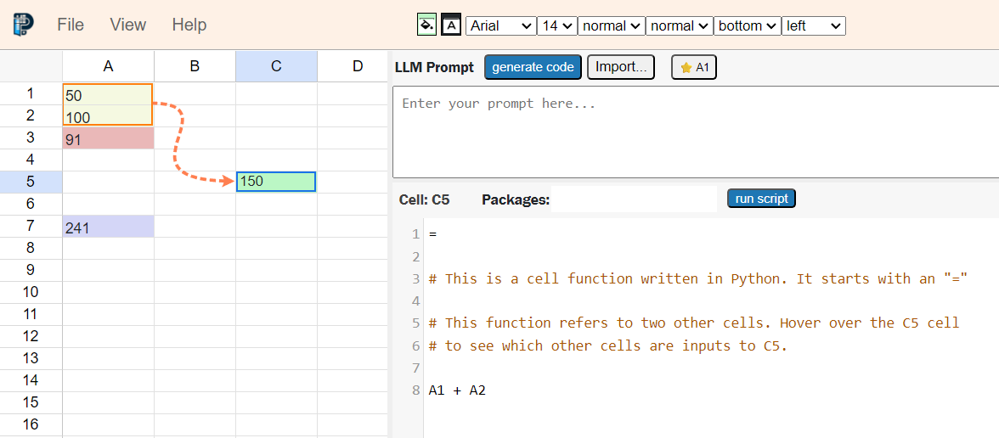
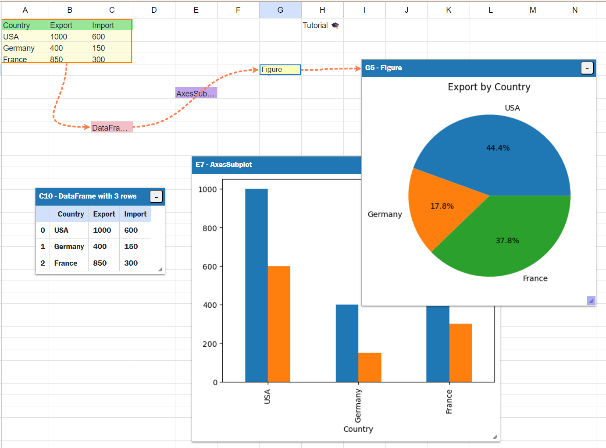
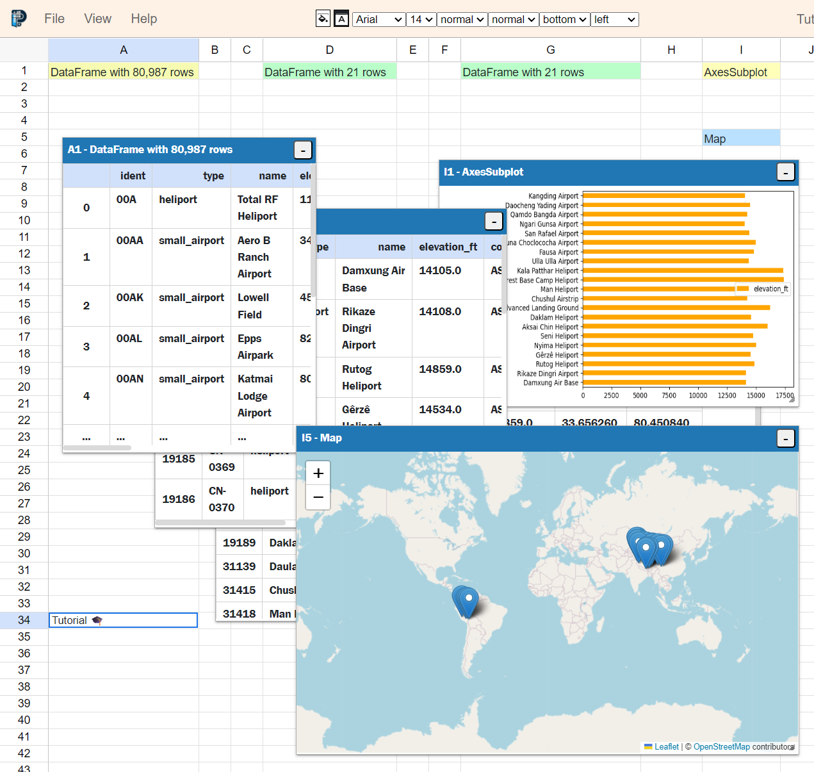
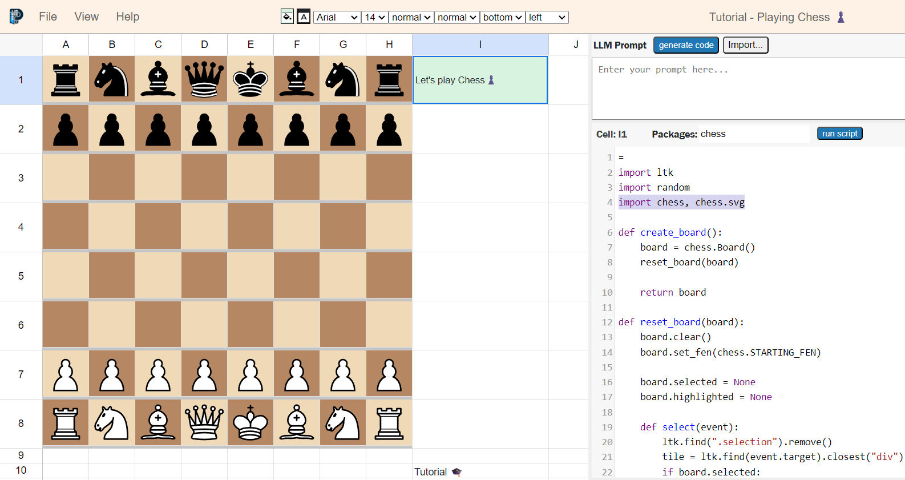
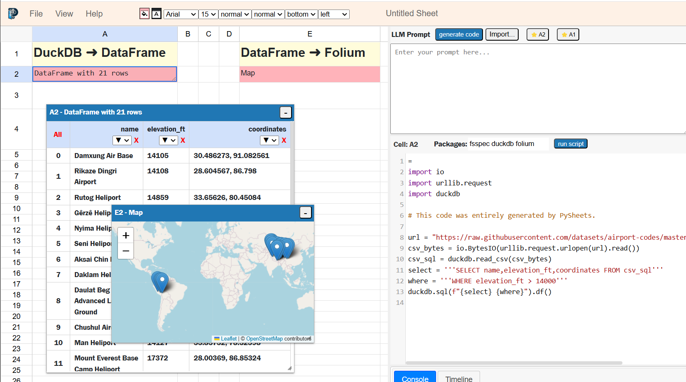
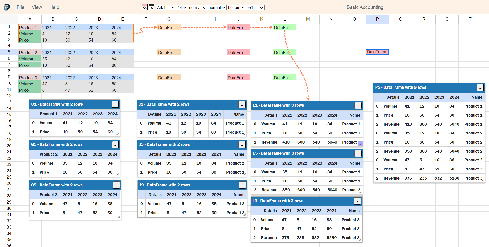
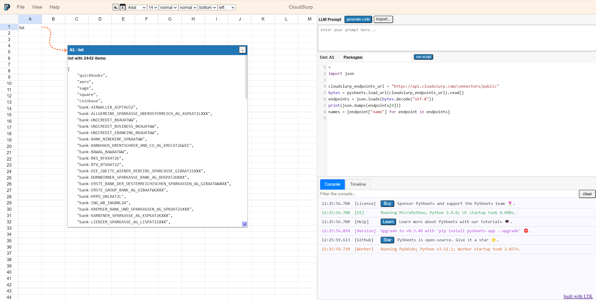
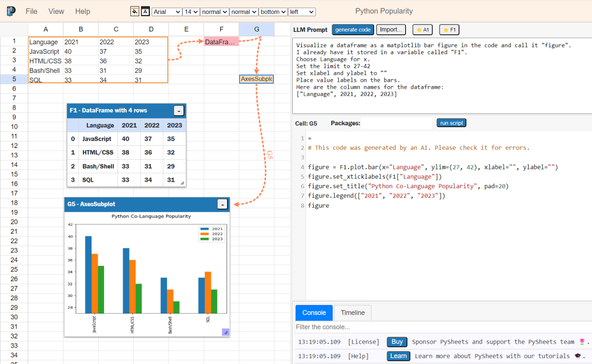

# PySheets

[PySheets](https://pysheets.app/about) is a spreadsheet UI for Python, implemented in Python, running logic and saving data in the browser, using PyScript and IndexedDB.


# Try it now

To run PySheets without locally installing it, simply visit [pysheets.app](https://pysheets.app)


# Installation on your own device

To install and run PySheets on your local machine, run:

```
pip install pysheets-app
pysheets
```

# Tutorials 

Run the tutorials below to familiarize yourself with PySheets and its powerful features.


## Tutorial: Basics 🛠️



In this tutorial, you will learn how to:
 - Create a Python cell function
 - Visualize the dependency graph in the spreadsheet

<a href="https://pysheets.app/?open=https://raw.githubusercontent.com/PySheets/pysheets/refs/heads/main/src/static/examples/tutorial_basics.json" target="_blank">Run the Basics tutorial now</a>


## Tutorial: Generating Simple Matplotlib Charts 📈



In this tutorial, you will learn how to:
 - Convert a part of the spreadsheet into a Pandas DataFrame
 - Visualize the dataframe as a bar graph
 - Generate your own visualization using the PySheets AI

<a href="https://pysheets.app/?open=https://raw.githubusercontent.com/PySheets/pysheets/refs/heads/main/src/static/examples/tutorial_charts.json" target="_blank">Run the Charts tutorial now</a>


## Tutorial: Finding the highest airports with PySheets ETL ✈️



In this tutorial, you will learn how to:
 - Import a CSV from the web and convert it into a Pandas DataFrame
 - Transform the DataFrame by removing rows and adding new columns
 - Generate a bar graph
 - Generate a map using Folium

This entire tutorial is using the low-code features of PySheets.
All code in this tutorial was AI-generated. No Python knowledge 
was needed to generate this dataflow.

<a href="https://pysheets.app/?open=https://raw.githubusercontent.com/PySheets/pysheets/refs/heads/main/src/static/examples/tutorial_airports.json" target="_blank">Run the Airports tutorial now</a>


## ️Tutorial: Playing Chess ♟



In this tutorial, you will learn how to:
 - Write a cell function that generates a chessboard
 - Access the PySheets main UI from a cell function
 - How the tutorial was generated

This entire tutorial is showcasing a unique feature of PySheets,
the ability to interact with the main UI from a cell function.

<a href="https://pysheets.app/?open=https://raw.githubusercontent.com/PySheets/pysheets/refs/heads/main/src/static/examples/tutorial_chess.json" target="_blank">Run the Chess tutorial now</a>


# Examples

## Example: DuckDB 🦆



This example shows how to load a CSV from the web and load it into DuckDB.

<a href="https://pysheets.app/?open=https://raw.githubusercontent.com/PySheets/pysheets/refs/heads/main/src/static/examples/quack.json" target="_blank">Run the DuckDB example now</a>


## Example: Basic Accounting ⊞



This example shows how to do basic accounting:
 - We convert sheet data into a Pandas DataFrame
 - We rename columns and add a new one
 - We calculate the revenue per year per product
 - We join all products into one DataFrame

This exercise shows how hard it is to manipulate rows in Pandas.
The reason is that Pandas dataframes were designed to focus on columns.
For use-cases such as this one, it would be better to handly multi-dimensional
data using pandas-pivot or by transposing the original dataframes.

<a href="https://pysheets.app/?open=https://raw.githubusercontent.com/PySheets/pysheets/refs/heads/main/src/static/examples/basic_accounting.json" target="_blank">Run the Basic Accounting example now</a>


## Example: CloudSlurp ☁️



This example shows how to download details about the [CloudSlurp](https://www.cloudslurp.com/) APIs from the web.

<a href="https://pysheets.app/?open=https://raw.githubusercontent.com/PySheets/pysheets/refs/heads/main/src/static/examples/cloudslurp.json" target="_blank">Run the CloudSlurp example now</a>


## Example: Python Popularity 🚀



This example takes data from the [State of Python 2024](http://blog.jetbrains.com/pycharm/2024/12/the-state-of-python/) report.
All the code in this example was AI-generated. No Python knowledge was needed to generate this dataflow.

<a href="https://pysheets.app/?open=https://raw.githubusercontent.com/PySheets/pysheets/refs/heads/main/src/static/examples/python_popularity.json" target="_blank">Run the Python Popularity example now</a>


# Find out more

Information sources for PySheets:
 - [pysheets.app/about](https://pysheets.app/about)
 - [Discord server](https://discord.gg/m6mkZ5me)
 - [Feedback form](https://docs.google.com/forms/d/e/1FAIpQLScmeDuDr5fxKYhe04Jo-pNS73P4VF2m-i8X8EC9rfKl-jT84A/viewform)

# Licensing

Ahead In The Cloud Computing makes PySheets available under both the GPLv3 and a
[commercial license](https://buy.stripe.com/00g1684SS2BZ9Es7st).

If you want to self-host PySheets for personal projects or evaluation purposes, the GPLv3 license applies. 
This license allows free use of the software but also implies that if you make any modifications or
extensions to PySheets, you must share those changes under the same license. 

Self-hosting installations of PySheets that want to use the software but do not want to be subject to the GPL and
do not want to release the source code for their proprietary extensions and addons, should purchase a
[commercial license](https://buy.stripe.com/00g1684SS2BZ9Es7st)
from Ahead In The Cloud Computing. Purchasing a commercial license means that the GPL does not apply, and a commercial 
license includes the assurances that distributors typically find in commercial distribution agreements.

When using PySheets for any commercial purpose, we recommend a [commercial license](https://buy.stripe.com/00g1684SS2BZ9Es7st).
Commercial use includes incorporating PySheets into a commercial product, 
using PySheets in any commercial service, 
leveraging PySheets to create algorithms or workflows that aim to produce a profit,
using PySheets in a commercial financial institution such as a bank or hedge fund,
or using PySheets to produce other artifacts for commercial purposes.
